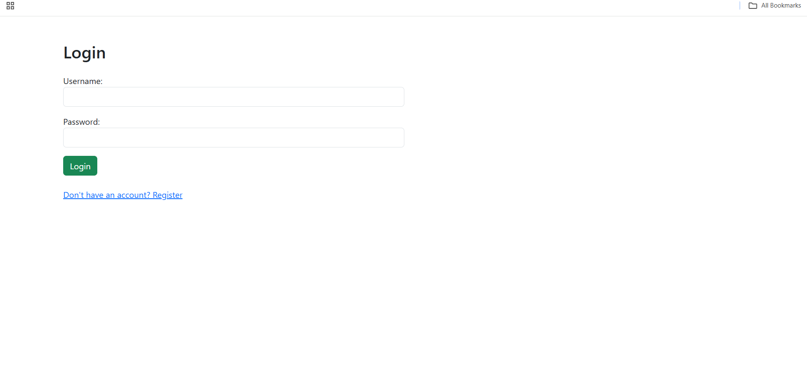
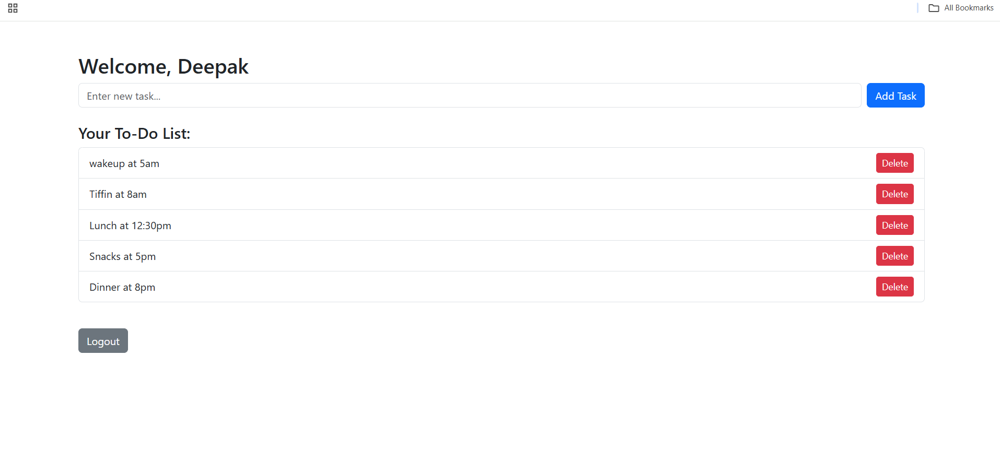

# ✅ To-Do App (Flask + SQLite + Bootstrap)

A simple to-do list web app built using Python, Flask, and SQLite.  
✔ User login  
✔ Task add/delete  
✔ Styled with Bootstrap  
✔ Live deployment

## 🔗 Live App:
https://todo-app-nrmo.onrender.com

## 📸 Screenshots

| Login Page | Dashboard |
|------------|-----------|
|  |  |

## 📫 Connect With Me
   💻 GitHub Code:
https://github.com/DeepakDoolipudi04/todo-app
   💼 LinkedIn:
www.linkedin.com/in/saimanideepakdoolipudi

## ✨ Built With:

-> Python 3

-> Flask

-> SQLite

-> Bootstrap

## 🙌 Author:

Built by DeepakDoolipudi04

## 💡 How to Run on Your Computer:

```bash
git clone https://github.com/DeepakDoolipudi04/todo-app
cd todo-app

python -m venv venv
venv\Scripts\activate  # or source venv/bin/activate on Linux/Mac

pip install -r requirements.txt
python app.py

Then open your browser and go to:
http://127.0.0.1:5000